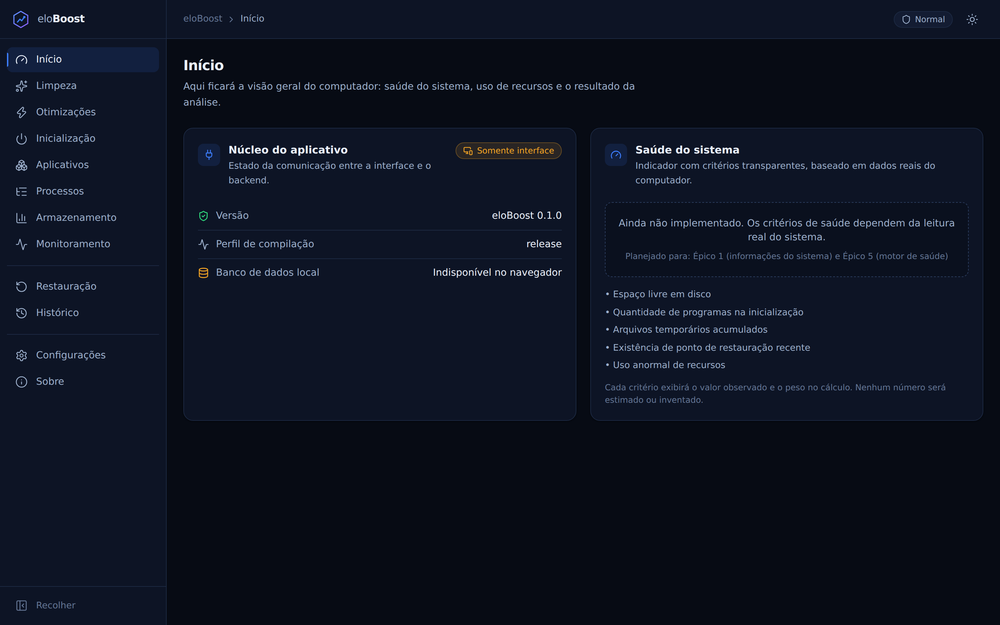
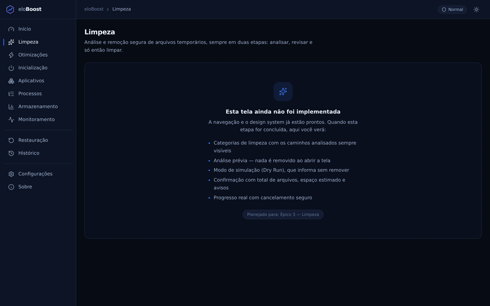
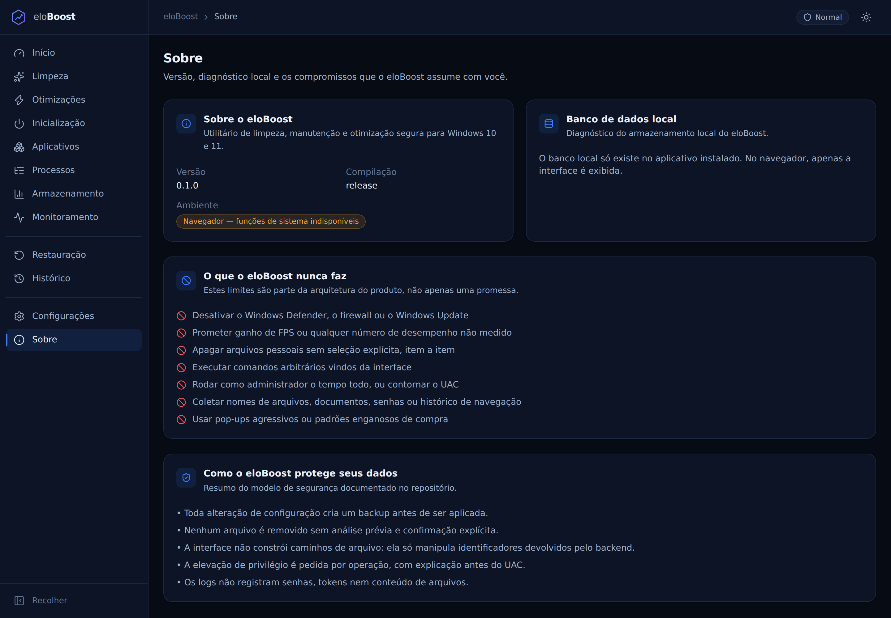
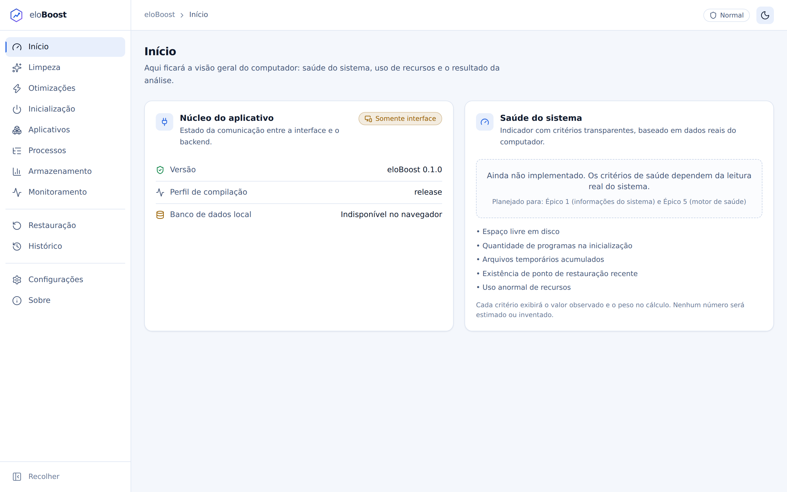

# eloBoost

> Utilitário de limpeza, manutenção e otimização **segura** para Windows 10 e 11.
>
> **Status: Épico 0 concluído — infraestrutura.** A aplicação abre, navega, tem design system,
> banco local com migrations e tratamento de erros ponta a ponta. **Nenhuma funcionalidade de
> limpeza, otimização ou acesso ao registro foi implementada** — as telas correspondentes declaram
> isso explicitamente, sem dados simulados.

---

## O que é

O eloBoost centraliza ferramentas legítimas de manutenção do Windows — limpeza de temporários,
análise de armazenamento, gerenciamento de inicialização, processos, aplicativos instalados,
monitoramento e ajustes de desempenho — com três compromissos inegociáveis:

1. **Nada acontece sem análise prévia e confirmação explícita.**
2. **Toda alteração de configuração é reversível**, com backup obrigatório antes de aplicar.
3. **Transparência total**: os caminhos analisados, os critérios de saúde e a origem de cada
   métrica são exibidos ao usuário.

## O que o eloBoost nunca fará

- Desativar Windows Defender, firewall ou Windows Update.
- Prometer ganho de FPS ou qualquer número de desempenho não medido.
- Apagar arquivos pessoais sem seleção explícita, item a item.
- Executar comandos arbitrários vindos da interface.
- Rodar como administrador o tempo todo, ou contornar o UAC.
- Coletar nomes de arquivos, documentos, senhas ou histórico de navegação.
- Usar pop-ups agressivos ou padrões enganosos de compra.

## Capturas de tela

| Início | Limpeza (ainda não implementada) |
| --- | --- |
|  |  |

| Sobre | Tema claro |
| --- | --- |
|  |  |

As capturas são geradas com `pnpm screenshots` a partir do build de produção. Como rodam no
navegador (sem o backend Tauri), as telas mostram o estado **"Somente interface"** — que é o
comportamento correto fora do aplicativo instalado.

## Tecnologias

| Camada | Escolha |
| --- | --- |
| Aplicativo desktop | Tauri 2 |
| Backend | Rust (workspace com `elo-core` + `src-tauri`) |
| Banco local | SQLite via `rusqlite`, com migrations versionadas |
| Interface | React 19 + TypeScript 5.9 (estrito) + Vite 8 |
| Estilo | Tailwind CSS 4 com tokens próprios |
| Animação / gráficos | Framer Motion · Recharts |
| Estado / validação | Zustand · Zod |
| Testes | Vitest + Testing Library · `cargo test` |

A comparação que levou a essa escolha está em [`docs/00-DECISAO-TECNICA.md`](docs/00-DECISAO-TECNICA.md).

## Pré-requisitos

- **Node.js 20.19+** (recomendado 22) e **pnpm 10+**
- **Rust estável** (1.77+) com `cargo`
- **Windows 10 (build 19041+) ou 11** para executar o aplicativo
- No Windows: **WebView2 Runtime** (já presente no Windows 11 e na maioria dos Windows 10)
- No Linux, apenas para desenvolvimento da interface e do núcleo:
  `libwebkit2gtk-4.1-dev libsoup-3.0-dev librsvg2-dev patchelf`

## Instalação

```bash
git clone https://github.com/Bunnyzzx/eloBoost.git
cd eloBoost
pnpm install
```

## Execução

```bash
# Aplicativo completo (interface + backend Rust)
pnpm tauri dev

# Apenas a interface, no navegador (backend indisponível, por design)
pnpm dev            # http://localhost:5173
```

Rodando só a interface, as chamadas ao backend falham com `BACKEND_UNAVAILABLE` e a tela mostra
o aviso "Somente interface" — em vez de travar ou exibir dados falsos.

## Build

```bash
pnpm build                  # interface (dist/)
pnpm tauri build            # instalador Windows (NSIS + MSI)
cargo build --workspace     # apenas o backend
```

## Testes e verificação

```bash
pnpm verify         # tsc --noEmit + eslint + vitest
pnpm verify:rust    # cargo fmt --check + clippy -D warnings + cargo test

pnpm test           # testes do frontend
pnpm test:coverage  # com cobertura
cargo test --workspace
```

**Nenhum teste toca pastas reais do Windows.** Os testes do banco usam SQLite em memória ou
diretórios temporários isolados; quando a limpeza for implementada (Épico 3), o `PathGuard`
construído a partir de `FakeSystemPaths` rejeitará qualquer caminho fora do diretório temporário
do teste.

## Estrutura

```
src/                 Interface React
  app/               App, rotas, tema, captura global de erros
  components/        Design system (ui, feedback, layout)
  pages/             12 telas
  services/          Única camada autorizada a chamar comandos Tauri
  schemas/           Validadores Zod das respostas do backend
  stores/            Zustand por domínio
  types/             Contratos espelhando os structs Rust

crates/elo-core/     Núcleo sem dependência do Tauri
  src/errors.rs      AppError, códigos e serialização
  src/db/            Banco local e migrations
  src/paths.rs       Mascaramento de dados sensíveis
  src/logging.rs     Log técnico com rotação
  migrations/        SQL versionado

src-tauri/           Aplicativo Tauri
  src/commands/      Comandos nomeados (a fronteira com a interface)
  capabilities/      Permissões mínimas da janela

docs/                Planejamento completo (11 documentos)
```

## Documentação

| Documento | Conteúdo |
| --- | --- |
| [00 — Decisão técnica](docs/00-DECISAO-TECNICA.md) | Tauri × .NET/WinUI × Electron, placar ponderado e limitações declaradas |
| [01 — Arquitetura](docs/01-ARQUITETURA.md) | Camadas, fluxo obrigatório de ação, serviços, cancelamento |
| [02 — Estrutura de diretórios](docs/02-ESTRUTURA-DE-DIRETORIOS.md) | Árvore do repositório por escopo |
| [03 — Modelo de dados](docs/03-MODELO-DE-DADOS.md) | DDL SQLite, migrations, retenção e privacidade |
| [04 — Contratos IPC](docs/04-CONTRATOS-IPC.md) | Comandos, tipos TS/Rust e catálogo de erros |
| [05 — Plano de segurança](docs/05-PLANO-DE-SEGURANCA.md) | Ameaças, `PathGuard`, allowlist, CSP, itens protegidos |
| [06 — Permissões administrativas](docs/06-PERMISSOES-ADMINISTRATIVAS.md) | Elevação por operação e broker elevado |
| [07 — Backup e reversão](docs/07-BACKUP-E-REVERSAO.md) | Camadas de proteção e recuperação pós-crash |
| [08 — Wireframes](docs/08-WIREFRAMES.md) | Identidade visual, telas, modais e acessibilidade |
| [09 — Backlog e roadmap](docs/09-BACKLOG-E-ROADMAP.md) | MVP / v1.0 / futuro, épicos e definição de pronto |
| [10 — Riscos](docs/10-RISCOS.md) | Riscos técnicos, de produto e legais |

## Limitações conhecidas

- **Nenhuma funcionalidade de sistema existe ainda.** Limpeza, otimizações, inicialização,
  processos, armazenamento e monitoramento estão apenas planejados. As telas dizem isso
  explicitamente e não exibem números inventados.
- **O aplicativo ainda não foi executado no Windows.** O ambiente de desenvolvimento atual é
  Linux; a compilação e os testes passam, mas a validação em Windows real ainda não ocorreu.
- **Sensores de temperatura e ventoinha** não serão suportados sem driver em modo kernel — o
  aplicativo exibirá "Informação não suportada neste dispositivo" em vez de estimar valores.
- **O instalador ainda não é assinado.** O pipeline de assinatura Authenticode está previsto para
  o Épico 13.

## Avisos de segurança

- O eloBoost pede elevação **por operação**, nunca para a sessão inteira, e sempre explicando
  antes o que será feito.
- A interface não constrói caminhos de arquivo nem chaves de registro: ela manipula apenas
  identificadores opacos devolvidos pelo backend.
- O plugin de shell do Tauri **não** está nas capabilities do aplicativo, o que torna a execução
  de um comando arbitrário impossível a partir da interface — mesmo em caso de falha na camada web.
- Os logs mascaram nome de usuário e caminhos, e nunca registram senhas, tokens ou conteúdo de
  arquivos.

## Próxima etapa

**Épico 1 — Informações reais do sistema** (SO, CPU, memória, discos, GPU, uptime), conforme
[`docs/09-BACKLOG-E-ROADMAP.md`](docs/09-BACKLOG-E-ROADMAP.md). Depende de uma máquina Windows
para validação das APIs nativas.
