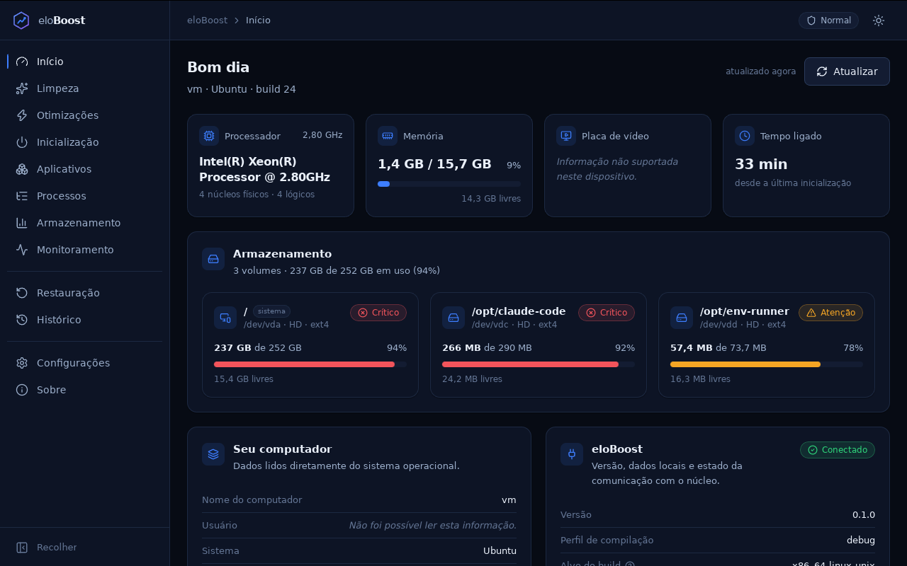
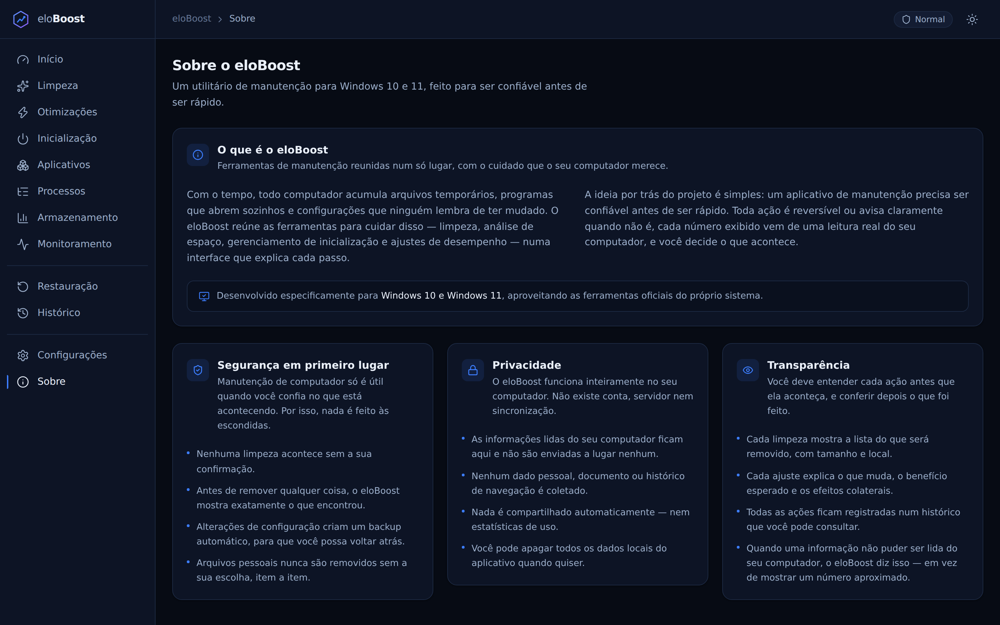
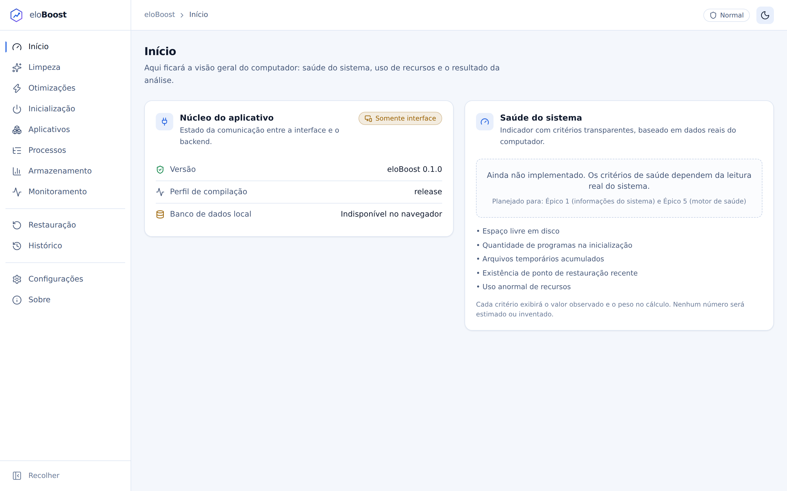

# eloBoost

> Utilitário de limpeza, manutenção e otimização **segura** para Windows 10 e 11.
>
> **Status: Épico 1 — dashboard com dados reais.** A tela Início lê informações verdadeiras do
> computador (sistema, CPU, memória, GPU, volumes, tempo ligado, privilégio) diretamente do backend
> Rust. **Nenhuma funcionalidade de limpeza, otimização ou escrita no registro foi implementada** —
> o acesso ao sistema é somente leitura, e as telas ainda não implementadas declaram isso
> explicitamente, sem dados simulados.

---

## O que é

O eloBoost centraliza ferramentas legítimas de manutenção do Windows — limpeza de temporários,
análise de armazenamento, gerenciamento de inicialização, processos, aplicativos instalados,
monitoramento e ajustes de desempenho — com três compromissos inegociáveis:

1. **Nada acontece sem análise prévia e confirmação explícita.**
2. **Toda alteração de configuração é reversível**, com backup obrigatório antes de aplicar.
3. **Transparência total**: os caminhos analisados, os critérios de saúde e a origem de cada
   métrica são exibidos ao usuário.

## O que o eloBoost nunca fará

- Desativar Windows Defender, firewall ou Windows Update.
- Prometer ganho de FPS ou qualquer número de desempenho não medido.
- Apagar arquivos pessoais sem seleção explícita, item a item.
- Executar comandos arbitrários vindos da interface.
- Rodar como administrador o tempo todo, ou contornar o UAC.
- Coletar nomes de arquivos, documentos, senhas ou histórico de navegação.
- Usar pop-ups agressivos ou padrões enganosos de compra.

## Capturas de tela

O dashboard, com dados reais lidos do sistema:



| Sobre | Tema claro |
| --- | --- |
|  |  |

As 19 capturas de `screenshots/` cobrem as 12 telas, os dois temas, as resoluções 1280×720,
1366×768, 1920×1080, a barra lateral recolhida e o aplicativo real em execução.

Para regenerá-las:

```bash
pnpm build
pnpm preview --port 4173 &
pnpm screenshots
```

Como rodam no navegador (sem o backend Tauri), as telas mostram o estado **"Somente interface"** —
que é o comportamento correto fora do aplicativo instalado, não um defeito da captura.

## Tecnologias

| Camada | Escolha |
| --- | --- |
| Aplicativo desktop | Tauri 2 |
| Backend | Rust (workspace com `elo-core` + `src-tauri`) |
| Banco local | SQLite via `rusqlite`, com migrations versionadas |
| Interface | React 19 + TypeScript 5.9 (estrito) + Vite 8 |
| Estilo | Tailwind CSS 4 com tokens próprios |
| Animação / gráficos | Framer Motion · Recharts |
| Estado / validação | Zustand · Zod |
| Testes | Vitest + Testing Library · `cargo test` |

A comparação que levou a essa escolha está em [`docs/00-DECISAO-TECNICA.md`](docs/00-DECISAO-TECNICA.md).

## Pré-requisitos

- **Node.js 20.19+** (recomendado 22) e **pnpm 10+**
- **Rust 1.97.0** — instalado automaticamente pelo `rustup` a partir de `rust-toolchain.toml`
- **Windows 10 (build 19041+) ou 11** para executar o aplicativo
- No Windows: **WebView2 Runtime** (já presente no Windows 11 e na maioria dos Windows 10)
- No Linux, apenas para desenvolvimento da interface e do núcleo:
  `libwebkit2gtk-4.1-dev libsoup-3.0-dev librsvg2-dev patchelf`

## 1. Instalar as dependências

```bash
git clone https://github.com/Bunnyzzx/eloBoost.git
cd eloBoost

pnpm install          # dependências do frontend
```

As dependências do Rust são baixadas automaticamente na primeira compilação. A versão do
compilador vem de `rust-toolchain.toml` (Rust 1.97.0) — o `rustup` instala sozinho na primeira
execução de `cargo`.

## 2. Executar apenas o frontend

```bash
pnpm dev
```

Abre em <http://localhost:5173>. Roda no navegador, **sem o backend**: as chamadas ao núcleo
falham com `BACKEND_UNAVAILABLE` e a interface exibe o aviso "Somente interface" — em vez de
travar ou mostrar dados falsos. Útil para trabalhar em UI sem recompilar Rust.

## 3. Executar pelo Tauri (aplicativo completo)

```bash
pnpm tauri dev
```

Sobe o Vite e o backend Rust juntos, abrindo a janela do aplicativo. É a única forma de exercitar
o caminho completo interface → comando Tauri → Rust → SQLite. Na primeira execução a compilação
do Rust leva alguns minutos.

O banco é criado em `%APPDATA%\\eloBoost\\eloboost.db` e os logs em
`%APPDATA%\\eloBoost\\logs\\`.

## 4. Rodar os testes

```bash
# Tudo de uma vez
pnpm verify           # tsc --noEmit + eslint + vitest
pnpm verify:rust      # cargo fmt --check + clippy -D warnings + cargo test

# Individualmente
pnpm typecheck
pnpm lint
pnpm test             # 100 testes do frontend
pnpm test:watch
pnpm test:coverage

cargo test --workspace --all-features   # 53 testes do backend
cargo clippy --workspace --all-targets --all-features -- -D warnings
cargo fmt --all --check
```

Verificação do código exclusivo do Windows sem uma máquina Windows — `cargo check` e `clippy` não
linkam, então o alvo GNU basta para type-checar tudo atrás de `#[cfg(windows)]`:

```bash
rustup target add x86_64-pc-windows-gnu
sudo apt-get install -y gcc-mingw-w64-x86-64   # apenas no Linux

CC_x86_64_pc_windows_gnu=x86_64-w64-mingw32-gcc \
  cargo clippy --target x86_64-pc-windows-gnu --workspace --all-targets --all-features -- -D warnings
```

Validação da camada de animações num navegador real — navegação rápida, ausência de deslocamento
de layout, barra lateral recolhida funcional e `prefers-reduced-motion` efetivo:

```bash
pnpm build
pnpm preview --port 4173 &
pnpm check:motion
```

**Nenhum teste toca pastas reais do Windows nem o registro.** Os testes do banco usam SQLite em
memória ou diretórios temporários isolados.

## 5. Gerar o build

```bash
pnpm build                  # interface de produção em dist/
cargo build --workspace     # backend em modo debug
cargo build --release       # backend otimizado

pnpm tauri build            # instalador Windows (NSIS + MSI) em
                            # src-tauri/target/release/bundle/
```

`pnpm tauri build` precisa ser executado **no Windows** para gerar o instalador da plataforma.

## Estrutura

```
src/                 Interface React
  app/               App, rotas, tema, captura global de erros
  components/        Design system (ui, feedback, layout)
  pages/             12 telas
  services/          Única camada autorizada a chamar comandos Tauri
  schemas/           Validadores Zod das respostas do backend
  stores/            Zustand por domínio
  types/             Contratos espelhando os structs Rust

crates/elo-core/     Núcleo sem dependência do Tauri
  src/errors.rs      AppError, códigos e serialização
  src/db/            Banco local e migrations
  src/paths.rs       Mascaramento de dados sensíveis
  src/logging.rs     Log técnico com rotação
  migrations/        SQL versionado
  tests/             Instalação limpa e contrato de erros

src-tauri/           Aplicativo Tauri
  src/commands/      Comandos nomeados (a fronteira com a interface)
  src/state.rs       Estado compartilhado (banco, pasta de dados)
  capabilities/      Permissões mínimas da janela
  icons/             Ícones do instalador

scripts/             Geração de ícones e capturas
screenshots/         Capturas versionadas das telas
docs/                Planejamento completo (11 documentos)
```

## Documentação

| Documento | Conteúdo |
| --- | --- |
| [00 — Decisão técnica](docs/00-DECISAO-TECNICA.md) | Tauri × .NET/WinUI × Electron, placar ponderado e limitações declaradas |
| [01 — Arquitetura](docs/01-ARQUITETURA.md) | Camadas, fluxo obrigatório de ação, serviços, cancelamento |
| [02 — Estrutura de diretórios](docs/02-ESTRUTURA-DE-DIRETORIOS.md) | Árvore do repositório por escopo |
| [03 — Modelo de dados](docs/03-MODELO-DE-DADOS.md) | DDL SQLite, migrations, retenção e privacidade |
| [04 — Contratos IPC](docs/04-CONTRATOS-IPC.md) | Comandos, tipos TS/Rust e catálogo de erros |
| [05 — Plano de segurança](docs/05-PLANO-DE-SEGURANCA.md) | Ameaças, `PathGuard`, allowlist, CSP, itens protegidos |
| [06 — Permissões administrativas](docs/06-PERMISSOES-ADMINISTRATIVAS.md) | Elevação por operação e broker elevado |
| [07 — Backup e reversão](docs/07-BACKUP-E-REVERSAO.md) | Camadas de proteção e recuperação pós-crash |
| [08 — Wireframes](docs/08-WIREFRAMES.md) | Identidade visual, telas, modais e acessibilidade |
| [09 — Backlog e roadmap](docs/09-BACKLOG-E-ROADMAP.md) | MVP / v1.0 / futuro, épicos e definição de pronto |
| [10 — Riscos](docs/10-RISCOS.md) | Riscos técnicos, de produto e legais |

## Limitações conhecidas

- **Nenhuma funcionalidade que altera o sistema existe.** Limpeza, otimizações, inicialização,
  processos e aplicativos estão apenas planejados. O Épico 1 entregou somente **leitura**.
- **O aplicativo ainda não foi executado no Windows.** O ambiente de desenvolvimento atual é
  Linux; a compilação, os testes e a execução passam aqui, mas os campos exclusivos do Windows
  (edição, versão comercial, GPU via DXGI, estado de elevação) só podem ser validados naquela
  plataforma. Fora do Windows eles aparecem como "informação não suportada neste dispositivo" —
  que é o comportamento correto, e não um defeito.
- **Sensores de temperatura e ventoinha** não serão suportados sem driver em modo kernel — o
  aplicativo exibirá "Informação não suportada neste dispositivo" em vez de estimar valores.
- **O instalador ainda não é assinado.** O pipeline de assinatura Authenticode está previsto para
  o Épico 13.

## Avisos de segurança

- O eloBoost pede elevação **por operação**, nunca para a sessão inteira, e sempre explicando
  antes o que será feito.
- A interface não constrói caminhos de arquivo nem chaves de registro: ela manipula apenas
  identificadores opacos devolvidos pelo backend.
- O plugin de shell do Tauri **não** está nas capabilities do aplicativo, o que torna a execução
  de um comando arbitrário impossível a partir da interface — mesmo em caso de falha na camada web.
- Os logs mascaram nome de usuário e caminhos, e nunca registram senhas, tokens ou conteúdo de
  arquivos.

## Próxima etapa

**Épico 2 — Segurança de caminhos (`PathGuard`)**, conforme
[`docs/09-BACKLOG-E-ROADMAP.md`](docs/09-BACKLOG-E-ROADMAP.md). É pré-requisito inegociável do
Épico 3 (limpeza): nenhuma função que remove arquivos é escrita antes de a camada de proteção
existir e estar testada.
